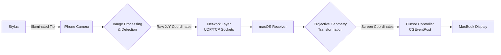
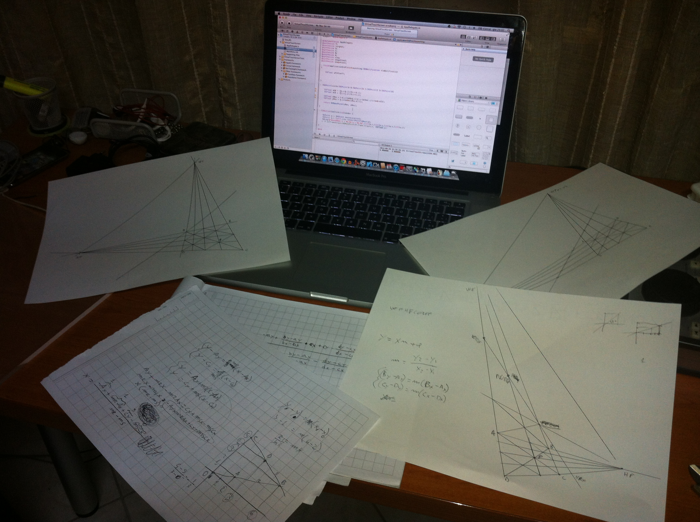

# VTS (2012) — Virtual Touch Screen

## Overview

VTS (Virtual Touch Screen) is an experimental system developed in 2012 that transformed a standard MacBook display into a touch-enabled surface. The project solved the problem of interacting with a non-touch display using external optical tracking, years before modern computer vision frameworks and AI-assisted development tools became widely accessible.

The system consisted of two primary components: an iPhone application acting as an optical sensor, and a macOS application functioning as the receiver and cursor controller. By tracking a custom stylus with a bright illuminated tip using the iPhone camera, the system mapped physical movement in physical space to precise cursor movements on the Mac screen in real-time.

## Historical Demo Video

This demo video was originally uploaded in 2012 when the project was first developed.

The video is hosted on my original personal YouTube channel, which I used at the time for various personal interests and experiments, including software projects and music.

*(Note: The video quality reflects the recording equipment and technology available at the time of development.)*

## How It Worked

The core logic relied on building a pipeline from raw optical data to operating system events:

1. **Bright-point detection**: The iPhone camera captured frames continuously. A custom image processing loop iterated through pixel data, converting RGB values to luminance.
2. **Coordinate extraction**: Pixels exceeding a specific luminance threshold were grouped based on spatial proximity. The centroid of these pixel clusters was calculated to determine the precise X/Y optical coordinates of the stylus tip.
3. **Network communication**: The extracted coordinates were continuously streamed over the local network via UDP/TCP sockets to the macOS application to minimize latency.
4. **Perspective correction**: Because the iPhone camera recorded the MacBook screen from an arbitrary angle, the optical coordinates suffered from severe perspective distortion. A custom 4-point calibration sequence established the screen boundaries (corners A, B, C, D). A custom projective geometry algorithm—originally derived manually on paper—computed vanishing points and dynamically corrected the perspective distortion.
5. **Cursor control**: The macOS application mapped the corrected coordinates to the physical resolution of the screen, smoothed the input to reduce optical jitter, and injected system-level mouse events (`CGEventPost`) to move the cursor and simulate clicks.

## Architecture

## Technical Challenges

Developing this system from scratch presented several engineering challenges:
- **Real-time image processing**: Processing raw byte buffers from the camera at a frame rate high enough for responsive tracking without exhausting the iPhone's processing power.
- **Coordinate tracking**: Distinguishing the stylus tip from background light sources and grouping valid pixels correctly.
- **Perspective transformation**: Deriving and implementing projective geometry equations from scratch to accurately map a 2D camera plane onto a 3D perspective plane.
- **Cross-device communication**: Establishing low-latency network connections between two distinct operating systems.
- **Calibration**: Designing a reliable state machine to map the screen boundaries before tracking begins.

### Original Design Notes

The projective geometry mathematics required to map the optical coordinates to the screen were originally derived by hand before being translated into Objective-C code. The image below shows the original 2012 notes containing the vanishing point diagrams and the linear equation systems used to calculate the perspective transformation.

## Historical Context & Preservation

This project was developed by a single developer in 2012, at the age of 18, prior to high school graduation. 

This repository serves as a historical snapshot and archive. It is intentionally preserved as originally written to showcase early engineering curiosity and problem-solving skills. The original architecture, coding style, naming conventions, and implementation choices have been retained. Some internal classes retain naming artifacts from earlier iterations (e.g., *NetworkingTesting*), reflecting the project's evolution from a simple socket communication experiment into a full computer vision application. 

The codebase has not been modernized, refactored, or optimized for contemporary standards.

## What Makes This Interesting Today

Looking back at this project from a modern perspective highlights several key engineering aspects:
- **Early experimentation with computer vision**: Implementing raw pixel manipulation and centroid extraction manually, without relying on high-level libraries like OpenCV or Vision framework.
- **Solving multidisciplinary problems**: Bridging networking, applied mathematics (projective geometry), hardware interaction, and OS-level APIs.
- **End-to-end system design**: Building a complete, functional prototype spanning multiple platforms and devices.
- **Resourcefulness**: Achieving complex functionality given the constraints of the tools, documentation, and frameworks available in 2012.

## Repository Structure

- `VTS_iOS/`: The Xcode project for the iOS application. Contains the camera capture, image processing, and network transmission logic.
- `VTS_Mac/`: The Xcode project for the macOS application. Contains the network receiving layer, the projective geometry algorithms, the calibration state machine, and the macOS event injection.

## Building the Project

Due to the historical nature of this repository, the project relies on obsolete iOS and macOS SDKs from 2012 (e.g., non-ARC Objective-C, older Xcode project formats, deprecated AVFoundation APIs). It is not expected to compile or run directly on modern versions of Xcode or macOS without significant modernization efforts, which falls outside the scope of this archival repository. Readers are encouraged to explore the source code directly (e.g., `ServerRunningViewController.m` for iOS detection and `MacNetworkingTestingAppDelegate.m` for macOS math and cursor control).
